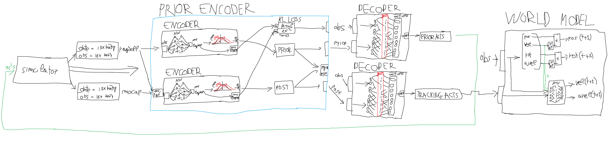
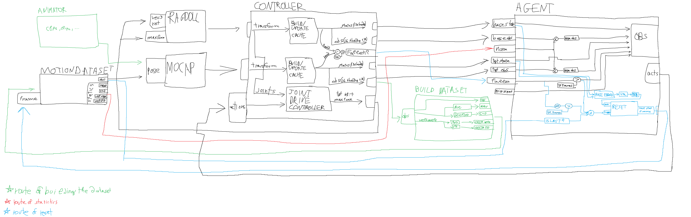

# PROJECT STRUCTURE

<div style="font-family: monospace;">
<span style="color:#58a6ff;">ControlVAE-Plugin/</span> <span style="color:#8b949e;">— root folder</span><br>
&nbsp;&nbsp;&nbsp;&nbsp;<span style="color:#58a6ff;">controlvae-main/</span> <span style="color:#8b949e;">— original repo code</span>
</div>

```
ControlVAE-Plugin
│   readme.md
│   requirements.yml
│   setup.py
│
├───config
│   │   config-inference.yaml
│   │   config-simple.yaml
│   │   config.yaml
│   │
│   └───high_level
│       ├───heading
│       │       config-heading.yaml
│       │
│       └───target_reaching
├───controlvae-main                             # original controlvae folder
│   │   .gitignore
│   │   arrow.obj
│   │   build_motion_dataset.py
│   │   LICENSE
│   │   odecharacter_scene.pickle
│   │   README.md
│   │   requirements.yml
│   │   setup.py
│   │   train_controlvae.py
│   │   VclSimuBackend-raw.py
│   │   __init__.py
│   │
│   ├───ControlVAECore
│   │   │   __init__.py
│   │   │
│   │   ├───Env
│   │   │       vclode_track_env.py
│   │   │
│   │   ├───Model
│   │   │   │   controlvae.py
│   │   │   │   modules.py                      # where encoder and decoder are
│   │   │   │   trajectory_collection.py
│   │   │   │   world_model.py                  # torch physics engine
│   │   │   │   __init__.py
│   │   │
│   │   └───Utils
│   │       │   diff_quat.py
│   │       │   index_counter.py
│   │       │   misc.py
│   │       │   motion_dataset.py
│   │       │   motion_utils.py
│   │       │   mpi_utils.py
│   │       │   pytorch_utils.py
│   │       │   radam.py
│   │       │   replay_buffer.py
│   │       │   __init__.py
│   │       │
│   │
│   ├───Data
│   │   │   ControlVAE.yml
│   │   │
│   │   ├───Misc
│   │   │   │   Grid_01_BaseMap.png
│   │   │   │   Grid_01_Emissive.png
│   │   │   │   Grid_01_Normal.png
│   │   │   │   test.bam
│   │   │   │   untitled.blend
│   │   │   │   world.json
│   │   │   │
│   │   │   └───drawstuff
│   │   │           checkered.ppm
│   │   │           ground.ppm
│   │   │           sky.ppm
│   │   │           wood.ppm
│   │   │
│   │   ├───Pretrained
│   │   │       .gitkeep
│   │   │       config.yml
│   │   │
│   │   └───ReferenceData
│   │       ├───binary_data
│   │       │       runwalkjumpgetup.pickle
│   │       │
│   │       └───runwalkjumpgetup
│   │               fallAndGetUp1_subject1.bvh
│   │               jumps1_subject1.bvh
│   │               run1_subject5.bvh
│   │               walk1_subject5.bvh
│   │
│   ├───Figure
│   │       box.gif
│   │       CrowdSimulation.gif
│   │       dance.gif
│   │       prediction.gif
│   │       PushForceLong-v2.gif
│   │       skill.gif
│   │       speed.gif
│   │       teaser.png
│   │       youtube.png
│   │
│   └───PlayGround
│       │   joystick_playground.py
│       │   Panda3dCameraCtrl.py
│       │   panda_server_base.py
│       │   playground_util.py                  # contains heading utils
│       │   play_bvh.py
│       │   random_playground.py
│       │   track_playground.py
│       │   __init__.py
│       │
│       ├───misc
│       │       character.bam
│       │       character.gltf
│       │       Checker.png
│       │       GroundScene.egg
│       │       skybox.bam
│
├───ControlVAE-Project                          # Unity Project
│       ControlVAEHeading.zip                   # build of heading training
│       ControlVAEwalkrunjumpgetup.zip          # build of walk run jump motion
│       UnityControlVAE2.zip                    # actual project
│
├───controlvae_plugin                           # actual plugin
│   │   actor.py                                # replacement of mlagents simpleactor(contains network, stepping for training, and forward for onnx)
│   │   optimizer.py                            # optimizer(contains optimizer and training functions)
│   │   plugin.py                               # registration in mlagents
│   │   policy.py                               # wrapper for actor to inject in trainer
│   │   run_inference.py                        # like run_training, but with inference parameters
│   │   run_training.py                         # copied from mlagents, used to add sidechannel without having to use envs
│   │   saver.py                                # custom saver because torchsaver doesn't accept non torchoptimizer or torchpolicy
│   │   settings.py                             # contains the settings to put in hyperparameters
│   │   shared_statics.py                       # statics class injected in run training and used for normalization
│   │   side_channel.py                         # side channel for shared statics
│   │   trainer.py                              # custom trainer to use the controlvae replay buffer
│   │   __init__.py
│   │
│   ├───debug
│   │       compare_onxx.py
│   │       debug.py
│   │
│   └───high_level                              # high level policies(currently unusable, see notes)
│       │   __init__.py
│       │
│       ├───heading                             # heading high level, requires custom actor, optimizer, settings and trainer
│       │       heading_actor.py
│       │       heading_optimizer.py
│       │       heading_settings.py
│       │       heading_trainer.py
│       │       __init__.py
│       │
│       └───target_reaching
└───results
    └───ppo                                     # for some reason mlagents puts it under ppo
        └───pretrained
            └───walkrunjumpgetup
                │   checkpoint.data
                │   ControlVAE-11057152.data
                │   ControlVAE-11057152.onnx
                │   events.out.tfevents.1774407793.DESKTOP-LE6Q7QJ.32036.0
                │
                └───Heading
                        checkpoint.data
                        ControlVAE-Heading-980992.data
                        ControlVAE-Heading-980992.onnx
```

# HOW CONTROLVAE WORKS


### Components:
- simulator: the "black box" physics engine. It outputs states([num bodies] x [3 pos, 4 rot, 3 vel, 3 avel]) and receives actions(3 x num bodies)
- [trajectory collector](../controlvae-main/ControlVAECore/Model/trajectory_collection.py): it steps the simulator for 2048 steps, alternating prior and posterior(see later) actions at a 50/50 rate to allow the latent to replicate the tracking
- [replay buffer](../controlvae-main/ControlVAECore/Utils/replay_buffer.py): the system that actually batches the trajectories received by the collector, and feeds them to the trainer as torch data loaders
- [encoder](../controlvae-main/ControlVAECore/Model/modules.py#L47): it's the base class of all the encoders, and it's used to distribute the observations in a latent space like a vae
- [simplelearnablepriorencoder](../controlvae-main/ControlVAECore/Model/modules.py#L89): it contains two encoders, one for prior(pure latent space replication) and another one for posterior(replication of target motion). In this code base the posterior is treated as an addition to the prior, that's why kl loss is done only on posterior
- [gatingmixeddecoder](../controlvae-main/ControlVAECore/Model/modules.py#L235): the actual "agent" of the system. It decodes the latent space trajectories into vec3 actions for the ragdoll pid joints, on top of that it uses a gating network to separate motion experts(walking, jumping, crawling...) for high level tasks
- [world model](../controlvae-main/ControlVAECore/Model/world_model.py): the torch "physics engine" used to run 24x more steps than the simulator allows. It integrates the states by euler and uses a mlp to add offsets to velocities based on current states and actions

# HOW THE PLUGIN WORKS

## Python:


### Components:
- [Replay Buffer](../controlvae-main/ControlVAECore/Utils/replay_buffer.py): [it takes in trajectories from unity](../ControlVAE-Plugin/controlvae_plugin/trainer.py#L223) and batches them as [data loaders](../controlvae-main/ControlVAECore/Utils/replay_buffer.py#L116), before [feeding them to the Optimizer](../ControlVAE-Plugin/controlvae_plugin/trainer.py#L355) for training
- [Actor](../ControlVAE-Plugin/controlvae_plugin/actor.py): it contains the [encoder, decoder and world model](../ControlVAE-Plugin/controlvae_plugin/actor.py#L90-L110), it [steps actions trough training](../ControlVAE-Plugin/controlvae_plugin/actor.py#L263) and exports to onnx trough [forward](../ControlVAE-Plugin/controlvae_plugin/actor.py#L349)
- [Policy](../ControlVAE-Plugin/controlvae_plugin/policy.py): wrapper for the actor, required by mlagents
- [Optimizer](../ControlVAE-Plugin/controlvae_plugin/optimizer.py): it contains the [schedulers and optimizers of the encoder, decoder and world model](../ControlVAE-Plugin/controlvae_plugin/optimizer.py#L76-80). Its functions "train_policy" and "train_world_model" are called by the trainer
- [Saver](../ControlVAE-Plugin/controlvae_plugin/saver.py): custom saver for the plugin, as TorchSaver doesn't accept custom optimizers and policies. It contains the same code as the original mlagents'
- [Trainer](../ControlVAE-Plugin/controlvae_plugin/trainer.py): it creates Replay Buffer, Policy, Actor, Optimizer and Saver. Additionally it [receives the full trajectories](../ControlVAE-Plugin/controlvae_plugin/trainer.py#L159) from unity every iteration, feeds them to the Replay Buffer, and updates the [Policy](../ControlVAE-Plugin/controlvae_plugin/trainer.py#L342)
- [Side Channel](../ControlVAE-Plugin/controlvae_plugin/side_channel.py): it receives statistics from unity(obs mean, obs std, delta mean, delta std) in the [run_training.py](../ControlVAE-Plugin/controlvae_plugin/run_training.py#L204)
- [Shared Statics](../ControlVAE-Plugin/controlvae_plugin/shared_statics.py): it stores the statistics received by the side channel and distributes them across [threads](../ControlVAE-Plugin/controlvae_plugin/optimizer.py#L94-117)
- [Settings](../ControlVAE-Plugin/controlvae_plugin/settings.py): contains the settings for the trainer in the shape of hyperparameters

## Unity:


### Components:
- Ragdoll: the slerp driven ragdoll. It takes in xyz rotations + max force as actions
- Mocap: the target armature on which the agent trains to replicate
- Controller: takes in the transforms of the ragdoll's and mocap's bodies, calculates observations, and sets the joint targets and max force
- Agent: composes observations, applies the actions received from the agent, and runs episodes up to 2048 steps(resetting every failure or 512)
- Motion Dataset: a file which contains observations regarding the target armature, plus their mean and std for normalization
- Build motion dataset: the system which computes the values of the Motion Dataset
- Index counter: it calculates a probability offset based on pose error to bias frame selection to the most difficult motions